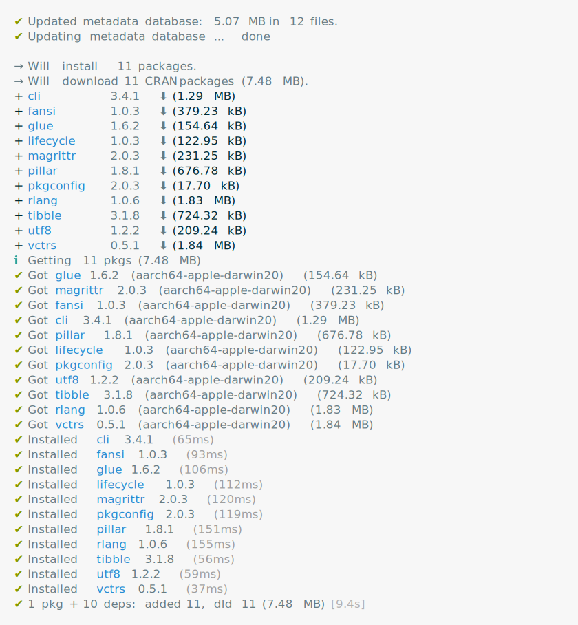
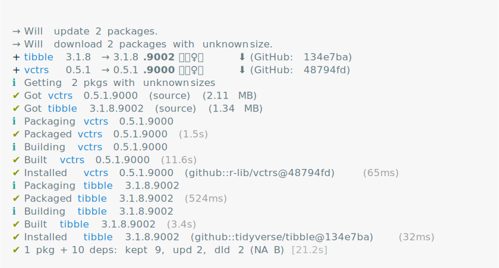
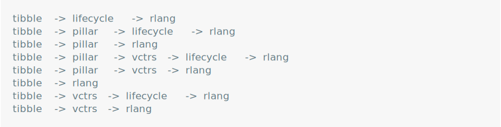

# pak

> A Fresh Approach to R Package Installation

<!-- badges: start -->

 [](https://cran.r-project.org/package=pak) [](https://www.r-pkg.org/pkg/pak) [](https://app.codecov.io/gh/r-lib/pak?branch=main) [](https://github.com/r-lib/pak/actions/workflows/R-CMD-check.yaml)

<!-- badges: end -->

pak installs R packages from CRAN, Bioconductor, GitHub, URLs, local files and directories. It is an alternative to `install.packages()` and `devtools::install_github()`. pak is fast, safe and convenient.

-   <a href="#rocket-short-tour" id="toc-rocket-short-tour">:rocket: Short
    tour</a>
-   <a href="#link-quick-links-start-here-if-in-doubt"
    id="toc-link-quick-links-start-here-if-in-doubt">:link: Quick links
    (start here if in doubt!)</a>
-   <a href="#sparkles-features" id="toc-sparkles-features">:sparkles:
    Features</a>
-   <a href="#arrow_down-installation"
    id="toc-arrow_down-installation"><span>:arrow_down:</span>
    Installation</a>
-   <a href="#blue_book-license"
    id="toc-blue_book-license"><strong>:blue_book:</strong> License</a>

<!-- README.md is generated from README.Rmd. Please edit that file -->

## :rocket: Short tour

#### Install or update packages from CRAN or Bioconductor

``` r
pak::pkg_install("tibble")
```

<picture>
  <source media="(prefers-color-scheme: dark)" srcset="./man/figures/cran-dark.svg">
  
</picture>

#### Install packages from GItHub

``` r
pak::pkg_install("tidyverse/tibble")
```



#### Look up dependencies

``` r
pak::pkg_deps_tree("tibble")
```


#### Explain dependencies

``` r
pak::pkg_deps_explain("tibble", "rlang")
```



#### Install a local package and its dependencies

``` r
pak::local_install("cli")
```


## :link: Quick links (start here if in doubt!)

### How do I … ?

Start with our [our TLDR
document](https://pak.r-lib.org/dev/reference/tldr.html) to solve
specific issues.

### FAQ

Check out [list of frequently asked
questions](https://pak.r-lib.org/dev/reference/faq.html).

### Reference

[The complete reference of pak
functions](https://pak.r-lib.org/dev/reference/) is the most complete
source of information about pak.

### I have a(nother) question

Don’t hesitate to ask at the [RStudio Community
forum](https://community.rstudio.com/). Use the `pak` tag.

### I would like to report a bug

Head to the [pak issue tracker](https://github.com/r-lib/pak/issues).

## :sparkles: Features

:zap: Fast - parallel downloads and installation, caching, etc.

:safety_vest: Safe - dependency solver, system dependency solver, etc.

:convenience_store: Convenient - packages from multiple sources, time
travel, etc.

See the [complete list of awesome
features](https://pak.r-lib.org/dev/reference/features.html).

## [:arrow_down:](https://github.com/r-lib/rig#%EF%B8%8F--installation) Installation

### Pre-built binaries

Install a binary build of pak from our repository on GitHub:

``` r
install.packages("pak", repos = sprintf("https://r-lib.github.io/p/pak/stable/%s/%s/%s", .Platform$pkgType, R.Version()$os, R.Version()$arch))
```

This is supported for the following systems:

| OS                 | CPU     | R version         |
|--------------------|---------|-------------------|
| Linux              | x86_64  | R 3.4.0 - R-devel |
| Linux              | aarch64 | R 3.4.0 - R-devel |
| macOS High Sierra+ | x86_64  | R 3.4.0 - R-devel |
| macOS Big Sur+     | aarch64 | R 4.1.0 - R-devel |
| Windows            | x86_64  | R 3.4.0 - R-devel |

For macOS we only support the official CRAN R build. Other builds, e.g.
Homebrew R, are not supported.

### Install from CRAN

Install the released version of the package from CRAN as usual:

``` r
install.packages("pak")
```

This potentially needs a C compiler on platforms CRAN does not have
binaries packages for.

### Other platforms and nightly builds

See the [installation
page](https://pak.r-lib.org/dev/reference/install.html)!

## **:blue_book:** License

GPL-3 © RStudio
